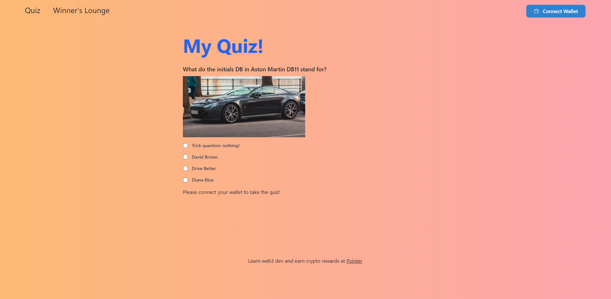

# Build a NFT Lootbox with thirdweb - Tutorial

Tutorial: https://www.pointer.gg/tutorials/thirdweb-nft-lootbox#welcome-to-nft-lootbox

Dapp: https://thirdweb-nft-lootbox.herokuapp.com/



# Built With
- [Next.js](https://nextjs.org/)
- [React.js](https://es.reactjs.org/)
- [TailwindCss](https://tailwindcss.com/)
- [thirdweb](https://thirdweb.com/)

## Getting Started

### Installation
1. Clone the repo
```
git clone https://github.com/AlbertoCruzLuis/thirdweb-nft-lootbox
```
2. Install NPM packages
```
npm i
```

## How to use

```
npm run dev
```

## How Deploy to Heroku
- Tutorial: https://gist.github.com/yektas/4edf3d4753a109852f768c30b4031f88
- Dapp: https://thirdweb-nft-lootbox.herokuapp.com/

## Contact
Alberto Cruz Luis - [Web](https://www.albertocruzluis.com/es) - [Twitter](https://twitter.com/AlbertoCruzdev)